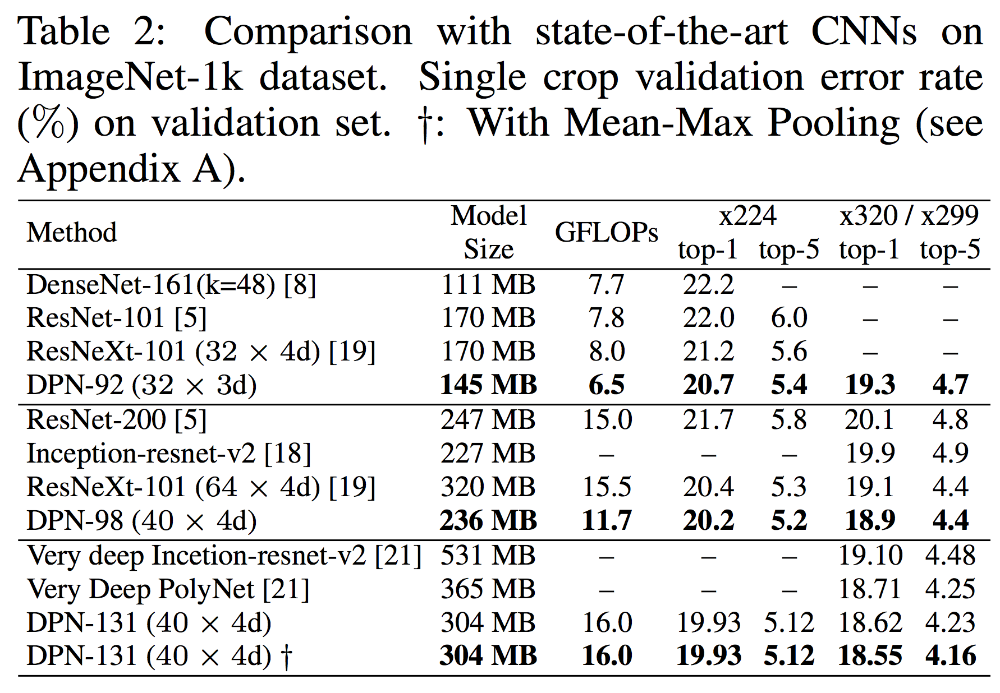

# pytorch-DPNs
Pytorch Imprementation of Dual Path Networks modified from [https://github.com/pytorch/examples/tree/master/imagenet](https://github.com/pytorch/examples/tree/master/imagenet).  

## Original results on ImageNet-1k

## Acknowledgement
A part of the code is based on implementation of [cypw/DPNs](https://github.com/cypw/DPNs)
